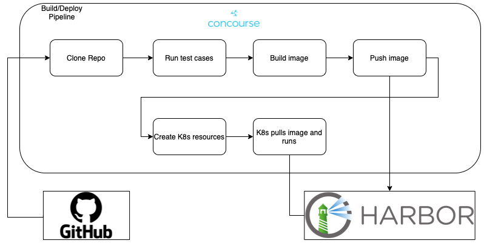

# Concourse pipeline creation



## Repo setup

```bash
ci/
	variables.yaml
manifests/
	deployment.yaml
	version
```

In the deployment file make sure the following are updated.

```yaml
image: harbor.guldentech.com/{rancher/harbor_project}/{repo_name}:TAG
```

```yaml
imagePullSecrets:
- name: guldentech-harbor-registry
```

```yaml
env:
- name: version
  value: THE_VERSION
```

### Create the variables file

```bash
# While inside your repo
mkdir ci
touch ci/variables.yaml
```

Copy the contents of the concourse-pipelines config/variables.yaml file into this new file and update the settings.


## Creating the pipeline

```bash
# While inside your repo
# Clone the concourse repo & your repo
# Cd into your repo and run

./fly -t guldentech set-pipeline \
	-p {repo_name} \
	-c  ../concourse-pipelines/pipelines/build-deploy.yaml \
	--team={concourse-team} \
	-l ci/variables.yaml
```

## Delete pipeline

```bash
# concourse-team is the same as rancher and harbor project

fly -t guldentech destroy-pipeline \
	-p {repo_name} \
	--team={concourse-team}
```
